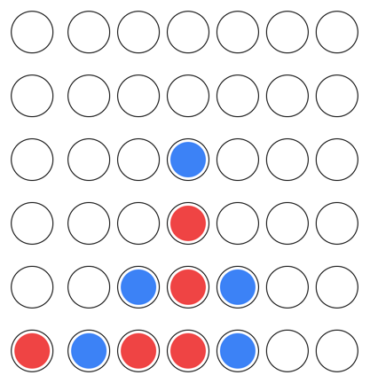

# Connect 4 Game

A modern Connect 4 game implementation using Next.js on the frontend and a Rust backend using Rocket.



## Features

- **Frontend**: Built with Next.js and hosted on Vercel.
- **Backend**: Efficient and fast backend written in Rust using the Rocket framework, deployed on Shuttle.

## Getting Started

### Prerequisites

- Node.js and npm for frontend.
- Rust and Cargo for the backend.

### Setup & Installation

**Frontend:**

1. Navigate to the frontend directory:
   ```
   cd frontend/
   ```
2. Install dependencies:
   ```
   npm install
   ```
3. Start the development server:
   ```
   npm run dev
   ```

**Backend:**

1. Navigate to the backend directory:
   ```
   cd backend/
   ```
2. Build and run the Rocket server:
   ```
   cargo run
   ```

## Deployment

**Frontend:** The frontend is hosted on Vercel. Link your GitHub repository to Vercel to set up automatic deployments on every push.

**Backend:** The backend is deployed on Shuttle. Follow Shuttle's documentation for Rust deployment guidelines.

## Contributing

Pull requests are welcome. For major changes, please open an issue first to discuss what you would like to change.

## License

This project is licensed under the GNU Affero General Public License - see the [LICENSE.md](LICENSE.md) file for details.
